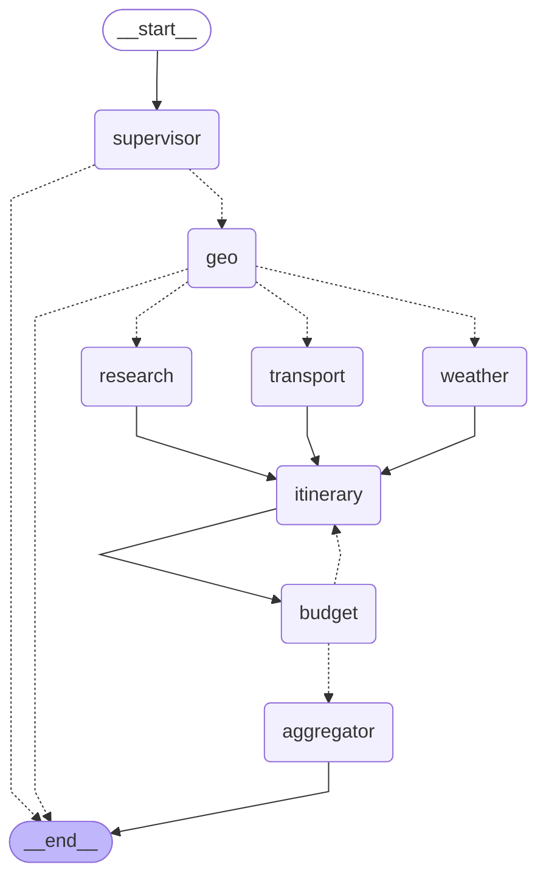

# TravelMate AI graph

Generated by `app.graph.build.mermaid()` from the compiled LangGraph.

```mermaid
---
config:
  flowchart:
    curve: linear
---
graph TD;
	__start__([<p>__start__</p>]):::first
	supervisor(supervisor)
	geo(geo)
	research(research)
	weather(weather)
	transport(transport)
	itinerary(itinerary)
	budget(budget)
	aggregator(aggregator)
	__end__([<p>__end__</p>]):::last
	__start__ --> supervisor;
	budget -.-> aggregator;
	budget -.-> itinerary;
	geo -.-> __end__;
	geo -.-> research;
	geo -.-> transport;
	geo -.-> weather;
	itinerary --> budget;
	research --> itinerary;
	supervisor -.-> __end__;
	supervisor -.-> geo;
	transport --> itinerary;
	weather --> itinerary;
	aggregator --> __end__;
	classDef default fill:#f2f0ff,line-height:1.2
	classDef first fill-opacity:0
	classDef last fill:#bfb6fc
```
